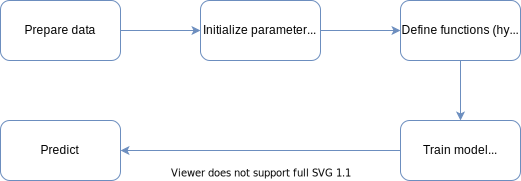
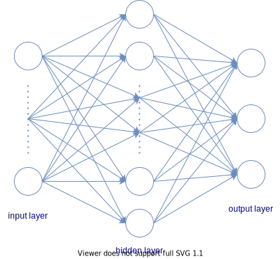

# Deep Learning with PyTorch: Zero to GANs

This is a summarization of the course [Deep Learning with PyTorch: Zero to GANs](https://jovian.ai/learn/deep-learning-with-pytorch-zero-to-gans) at Jovian.

1. [PyTorch Basic](#i-pytorch-basic): basic operators of PyTorch.
2. [Linear Regression](#ii-linear-regression): train a linear regression from scratch and using PyTorch built-ins function.
3. [Logistic Regression](#iii-logistic-regression): classify handwritten digits using MNIST handwritten digit database as training dataset.
4. [Insurance Cost Prediction](#iv-insurance-cost-prediction): predict the price of yearly medical bills based on personal information.
5. [Training Deep Neural Networks on a GPU](#v-train-deep-neural-networks-on-a-gpu): identify handwritten digits from MNIST dataset by using a neural network.

<!---

## Write Math Formula

```

```

- Online Latex Equation Editor: https://www.codecogs.com/latex/eqneditor.php
- URL Encode & Decode: https://www.urlencoder.org/

Example:

```
Given the training set 
```

Given the training set 

--->
## I. PyTorch Basic

### Tensor
- Create a tensor
```Python
t1 = torch.tensor(4.)  # single number
t2 = torch.tensor([1, 2, 3, 4])  # vector
t3 = torch.tensor([[5, 6]
                   [7, 8],
                   [9, 10]
                 ])  # matrix
```
- Tensor attributes:
    - `t.dtype` : the type of a tensor like `float32`, `double64`, etc.
    - `t.shape` : the size of a tensor like `torch.Size([4])`, `torch.Size([3, 2])`

### Tensor operations and gradients

1. Operations
```Python
x = torch.tensor(3.)
w = torch.tensor(4., requires_grad = True)
b = torch.tensor(5., requires_grad = True)
y = w*x + b
```
- `requires_grad = True` to set that we will compute  and 

2. Compute gradients
```Python
y.backward()
print('dy/dx = ', x.grad)
print('dy/dw = ', w.grad)
print('dy/db = ', b.grad)
```
- `y.backward()` : computes the derivatives of `y` with respect to the input tensors `x, w, b`.
- the tensor attribute `grad` stores the derivative of `y` of the respective tensors.
    - `x.grad` stores . In this case, it is `None` since `x` doesn't have `requires_grad = True`
    - `w.grad` stores . In this case, it is the value of `x`, `tensor(3.)`.
    - `b.grad` stores . In this case, it is `tensor(1.)`

3. Interoperability with Numpy
- Convert a Numpy array to a PyTorch tensor, using `torch.from_numpy`
```Python
x = np.array([[1, 2],
              [3, 4]
            ])
y = torch.from_numpy(x)
type(x), type(y)
```
- Convert a tensor to a numpy, using the method `numpy`
```Python
z = y.numpy()
type(z)
```

## II. Linear Regression

This part mentions how to **train a linear regression model in PyTorch** in two ways:
- [from scratch](#a-linear-regression-from-scratch), functions are built manually.
- [using PyTorch built-ins function](#b-linear-regression-using-pytorch-built-ins).

> Linear Regression supposes that there's a linear relation between inputs and outputs (targets).

### A. Linear Regression from scratch

The figure below presents the workflow of this section.
<p align="center">

</p>

- [x] Convert inputs & targets to tensors: convert data (*inputs* & *targets*) from numpy arrays to tensors.
- [x] Initialize parameters: identify the number of samples, of features and of targets. Initialize *weights* and *bias* to predict target. Theses parameters will be optimized in training process.
- [x] Define functions: create *hypothesis function* (model) to predict target from input, and *cost function* (loss function) to compute the difference between the prediction and the target.
- [x] Train model: find the *optimal values* of the parameters (weights & bias) by using gradient descent algorithm.

:warning: Make sure reset gradients to zero before the next iteration.
- [x] Predict: using optimal parameters to predict target from a given input.

#### Import libraries
```Python
import numpy as np
import torch
```

#### 1. Prepare data
```Python
X = torch.from_numpy(inputs)
Y = torch.from_numpy(targets)
```

#### 2. Initialize parameters
```Python
# get number of samples (m) and features (n)
m, n = X.shape

# get number of outputs
_, a = Y.shape

# initialize parameters
W = torch.randn(a, n, requires_grad=True)  # weights
b = torch.randn(a, requires_grad=True)  # bias
```
- the function `torch.randn()` creates a tensor with the given shape with elements picked from a *normal distribution* with *mean 0* and *standard deviation 1*.
- In steps after we will optimize parameters `W, b` by using gradient descent, so we will need to compute `dy/dW` and `dy/db`. That's why `W` and `b` are set `requires_grad=True`.

#### 3. Define functions
##### Hypothesis function (model)
Predicts `y` from `x` and parameters `W, b`.
```Python
def model(X, W, b):
    Y_hat = X @ W.t() + b
    return Y_hat
```
 - the operator `@` indicates that we want to do matrix multiplication.
 - the method `t()` returns the transpose of a tensor.

##### Cost function (loss function)
Computes the difference between predicted values `Y_hat` and output values `Y`.
```Python
def cost_fn(Y_hat, Y):
    diff = Y_hat - Y
    return torch.sum(diff * diff)/diff.numel()
```
 - the function `torch.sum()`  returns the sum of all the elements in a tensor.
 - the method `numel()` returns the number of elements in a tensor.

#### 4. Train model
:writing_hand: **Gradient Descent:** this algorithm repeats the process of adjusting the weights and biases using the gradients multiple times to reduce the loss.
- Each iteration is called an **epoch**.

```Python
epochs = 100  # number of iteration
lr = 1e-5  # learning rate
for i in range(epochs):
    Y_hat = model(X, W, b)
    cost = cost_fn(Y_hat, Y)
    cost.backward()  # compute derivatives
    # update parameters
    with torch.no_grad():
        W -= W.grad * lr
        b -= b.grad * lr
        W.grad.zero_()
        b.grad.zero_()
```

- the method `cost.backward()` computes the derivatives of `cost` with respect to `W` and `b`.
- the function `torch.no_grad()` indicates to PyTorch that we shouldn't track, calculate, or modify gradients while updating parameters `W` and `b`
- the method `grad.zero_()` resets the gradients to zero. As PyTorch accumulates gradients, we need to reset them before the next time we invoke  `backward()` on the loss.

#### 5. Predict
```Python
x = torch.tensor([[75, 63, 44.]])
y_hat = model(x)
print(y_hat.tolist())
```
- the method `tolist()` converts a vector tensor in list
- the method `item()` returns the value of a single tensor.

### B. Linear Regression using PyTorch built-ins

The figure below presents the workflow of this section.
<p align="center">

</p>

- [x] Convert inputs & targets to tensors: convert data (*inputs* & *targets*) from numpy arrays to tensors.

:warning: Make sure that numpy arrays are in data type `float32`.
- [x] Define dataset & dataloader:
    - dataset are tuples of inputs & targets.
    - dataloader shuffles the dataset and divides a dataset into batches.
- [x] Define functions:
    - identify the number of features and of targets, set model is a linear function.
    - set cost function is a mean squared loss function.
- [x] Define optimizer: identifies the algorithm using to adjust model parameters. Set optimzer to use stochastic gradient descent algorithm.
- [x] Train model: find the *optimal values* of model parameters by repeating the process of optimizing.

:warning: Make sure reset gradients to zero before the next iteration.
- [x] Predict: using optimal parameters to predict target from a given input.

#### Import libraries
```Python
import torch.nn as nn
from torch.utils.data import TensorDataset
from torch.utils.data import DataLoader
import torch.nn.functional as F
```

#### 1. Prepare data

##### Convert inputs & targets to tensors
```Python
X = torch.from_numpy(inputs)
Y = torch.from_numpy(targets)
```

##### Define dataset & data loader
```Python
dataset = TensorDataset(X, Y)
batch_size = 5
dataloader = DataLoader(dataset, batch_size, shuffle=True)
```
- `TensorDataset` returns a tuple of two elements in which the first one contains the inputs and the second one contains the outputs.
    - Allow to access a small section of the dataset using the array indexing notation.
- `DataLoader` splits the dataset into batches of a predefined size while training.
    - `batch_size` indicates how many samples in a batch. For example, if `dataset` contains `15` samples and `batch_size = 5`, `dataloader` will point to `3` batches, each batch contain `5` samples.
    - `shuffle=True` means the dataset will be shuffled before creating batches. It helps randomize the input to the optimization algorithm, leading to a faster reduction in the loss.
    - Access the elements of data loader by using `for` loop.
```Python
for batch in dataloader:
    print(batch)
    xs, ys = batch
    print(xs.data); print(ys.data)
```
- **The idea of data loader** is that if the dataset is too big it takes time to train the whole dataset multiple times. Therefore, instead of training whole dataset, we devide the dataset into batches and at each batch iteraton (`for batch in dataloader`), we only train samples in one batch. We need some (`len(dataset)/batch_size`) iterations to train the whole dataset.

#### 2. Define functions
##### Hypothesis function (model)
```Python
# get number of samples (m) and of features (n)
m, n = X.shape

# get number of outputs
_, a = Y.shape

# define hypothesis function
model = nn.Linear(n, a)

print(model.weight)
print(model.bias)
print(list(model.parameters()))
```
- Model attributes `weight` and `bias` contains the weights and bias of a model.
- the method `parameters()` return a generator of a list containing the weights and bias of a model.
##### Cost function (loss function)
```Python
cost_fn = F.mse_loss
```
- the function `mse_loss()` measures the element-wise mean squared error. It takes two obligatory inputs: *input* and *target* ([more detail](https://pytorch.org/docs/stable/nn.functional.html#mse-loss)).

#### 3. Define optimizer

Optimizer identifies the algorithm using to adjust model parameters.
```Python
opt = torch.optim.SGD(model.parameters(), lr=1e-5)  # use the algorithm stochastic gradient descent
```
- the function `torch.optim.SGD` optimizes parameters which are passed in `model.parameters()` with the learning rate passed in the parameter `lr`.
- `SGD` stands for *stochastic gradient descent*. The terms *stochastic* indicates that samples are selected in random batches instead of as a single group.

#### 4. Train model
```Python
def fit(epochs, model, cost_fn, opt, dataloader):
    for i in range(epochs):
        for batch in dataloader:
            xs, ys = batch
            ys_hat = model(xs)
            cost = cost_fn(ys_hat, ys)
            cost.backward()
            opt.step()  # adjust model parameters
            opt.zero_grad()  # reset gradients to zero

fit(100, model, cost_fn, opt, dataloader)
```
- the optimizer method `step()` updates parameters (weights and bias).
- the optimizer method `zero_grad()` resets the gradients to zero.

#### 5. Predict
```Python
x = torch.tensor([[75, 63, 44.]])
y_hat = model(x)
print(y_hat.data)
```

The complete code of this part is in the notebook [linear regression.ipynb](linear%20regression.ipynb).

## III. Logistic Regression

This part mentions how to **train a model to classify handwritten digits**. We will use the famous [MNIST handwritten digit database](http://yann.lecun.com/exdb/mnist/) as our training dataset. It consists of 28 x 28 pixels grayscale images of handwritten digits (0 to 9) and labels for each image indicating which digit it represents. The trained model is save to file after the training process.

Here are some sample images from the dataset:
<p align="center">

</p>

<p align="center">
(image source: <a href="https://www.researchgate.net/publication/306056875_An_analysis_of_image_storage_systems_for_scalable_training_of_deep_neural_networks">researchgate.net</a>)
</p>

> We suppose that there'are linear lines separating digit groups.

### Workflow
<p align="center">

</p>

### Import libraries
```Python
import torch
import torchvision
from torchvision.datasets import MNIST
import torchvision.transforms as transforms
from torch.utils.data import random_split
from torch.utils.data import DataLoader
import torch.nn as nn
import torch.nn.functional as F
import matplotlib.pyplot as plt
```

### 1. Prepare data

#### 1.1 Convert train & test images to tensors

```Python
dataset = MNIST(root='data/', train=True, transform=transforms.ToTensor(), download=True)
test_ds = MNIST(root='data/', train=False, transform=transforms.ToTensor())
```
- the first line will download images from [MNIST handwritten digit database](http://yann.lecun.com/exdb/mnist/) to the directory `data` and create a Pytorch `dataset`. This dataset contains 60 000 images. We will use this dataset to train the model.
- the second line will create a Pytorch `dataset` containing 10 000 images. We use this dataset to evaluate models. We don't need to download images since they're already downloaded.

#### 1.2 Split train images to train & validation sets
```Python
data_size = len(dataset)
train_size = round(data_size*0.8)
val_size = data_size - train_size
train_ds, val_ds = random_split(dataset, [train_size, val_size])
```
- the PyTorch method `random_split` choose a random sample of size `val_size` for creating a validation dataset, and a random sample of size `train_size` for creating a training dataset. There's no ntersection sample of these two datasets.

#### 1.3 Define batch size and dataloaders
```Python
batch_size = 128
train_loader = DataLoader(train_ds, batch_size, shuffle=True)
val_loader = DataLoader(val_ds, batch_size*2)
test_loader = DataLoader(test_ds, batch_size*2)
```

### 2. Create model

In this section we build a model class containing four methods:
- `forward()` computes linear predictions of outputs from tensor inputs.
- `predict()` predicts label from a linear predictions.
- `cost_func()` measures the difference between predicted and real label.
- `evaluate_batch()` evaluates a batch on two criteria: the cost and the accuracy.

```Python
class MnistModel(nn.Module):
    def __init__(self):
        super().__init__()
        self.linear = nn.Linear(in_features, out_classes)

    def forward(self, X):
        X = X.reshape(-1, self.linear.in_features)
        Y_linear = self.linear(X)
        return Y_linear

    # predict label
    def predict(self, X):
        Y_linear = self(X)
        probs = F.softmax(Y_linear.detach(), dim=1)
        _, Y_hat = torch.max(probs, dim=1)
        return Y_hat
```
- the method `reshape()` indicates to PyTorch that we want a view of X with two dimensions. The first dimension `-1`  let PyTorch figure it out automatically based on the shape of the original tensor.
- `self(X)` will call the method `forward()`. Therefore, its result is the result of `self.forward(X)`
- the function `F.softmax()` convert the results of linear computations into probabilities.
- the function `torch.max()` returns each row's largest element and the corresponding index. `dim=1` indicates to PyTorch that we want to find maximal values based on rows.
- the method `detach()` indicates PyTorch disables automatic differentiation.

```Python
# compute cost
def cost_func(self, batch):
    images, labels = batch
    Y_linear = self(images)
    cost = F.cross_entropy(Y_linear, labels)
    return cost
```
- the function `cross_entropy()` is a continuous and differentiable function. **It performs `softmax` internally**, so we can directly pass the `Y_linear` into this function without converting them into probabilities.

```Python
# evaluate a batch
def evaluate_batch(self, batch):
    images, labels = batch
    Y_hat = self.predict(images)
    acc = torch.sum(Y_hat == labels).item()/len(Y_hat)
    Y_linear = self(images)
    cost = F.cross_entropy(Y_linear.detach(), labels).item()
    res = {
        'cost': cost,
        'accuracy': acc
    }
    return res
```
- `torch.sum(Y_hat == labels)` computes the number of right prediction.

### 3. Define optimizer

We use gradient descent to adjust model parameters.
```Python
lr = 1e-3  # learning rate
optimizer = torch.optim.SGD(model.parameters(), lr)
```

### 4. Train model

#### 4.1. Training phase
<p align="center">

</p>

```Python
# training phase
for batch in train_loader:
    cost = model.cost_func(batch)  # compute cost
    cost.backward()  # compute gradients
    optimizer.step()  # adjust model parameters
    optimizer.zero_grad()  # reset gradients to zero
```

#### 4.2 Validation phase
<p align="center">

</p>

```Python
# evaluate a batch
def evaluate_batch(self, batch):
    images, labels = batch
    Y_hat = self.predict(images)
    acc = torch.sum(Y_hat == labels).item()/len(Y_hat)
    Y_linear = self(images)
    cost = F.cross_entropy(Y_linear.detach(), labels).item()
    log = {
        'cost': cost,
        'accuracy': acc
    }
    return log
```

### 5. Save model
```Python
filename = 'mnist_logistic.pth'
torch.save(model.state_dict(), filename)
```
- the method `state_dict()` returns an `OrderedDict` containing all the weights and bias matrices mapped to the right attributes of the model.
- to load the model we can instantiate a new object of the class `MnistModel` and use the method `load_state_dict()`
```Python
# load model from file
model2 = MnistModel(in_features, out_classes)
model2.load_state_dict(torch.load(filename))
```

The complete code of this part is in the notebook [logistic regression.ipynb](logistic%20regression.ipynb).

## IV. Insurance Cost Prediction

In this part, we're going to use information like a person's age, sex, BMI, number of children and smoking habit to **predict the price of yearly medical bills**. This kind of model is useful for insurance companies to determine the yearly insurance premium for a person.

The dataset for this problem is taken from [Kaggle](https://www.kaggle.com/mirichoi0218/insurance).

### Workflow

The figure below presents the workflow of the training process.
<p align="center">

</p>

- [x] Prepare data: dowload data in CSV file from the URL source, customize data, convert categorical data into numbers, convert numpy arrays to tensors, define datasets & data loaders, and explorer data.
- [x] Create model: since the target is continuous, we'll use the linear regression model for this problem.
- [x] Define optimizer: we'll use gradient descent to adjust model parameters.
- [x] Train model: train model on training set and perform evaluation on validation set.
- [x] Make predictions: carry out some predictions on validation set.

### 1. Prepare data

- Download data from URL source
```Python
DATASET_URL = "https://raw.githubusercontent.com/stedy/Machine-Learning-with-R-datasets/master/insurance.csv"
DATA_FILENAME = "insurance.csv"
download_url(DATASET_URL, '.')
```
- Customize data: create a particular data from the raw data. This is to test the ability of building a model that can works well with different range of features and large scale of targets.
```Python
rand_str = "anh-tuan"
df = customize_data(df_raw, rand_str)
df.head()
```
- Convert categorical data to numbers: since there'are categorical data in inputs, we need to convert them to numbers before training.
```Python
input_cols = ['age', 'sex', 'bmi', 'children', 'smoker']
cat_cols = ['sex', 'smoker']
output_cols = ['charges']

inputs, targets = df_to_arrays(df, input_cols, cat_cols, output_cols)
```
- Convert numpy arrays to tensors: before converting numpy arrays to tensors, we need to make sure they are in the data type `float32`.
```Python
X = torch.from_numpy(inputs.astype('float32'))
Y = torch.from_numpy(targets.astype('float32'))
X.dtype, Y.dtype
```
- Define datasets & data loaders: split the dataset into training set & validation set, then create corresponding train loader & validation loader.
```Python
dataset = TensorDataset(X, Y)
train_ds, val_ds = random_split(dataset, [train_size, val_size])
train_loader = DataLoader(train_ds, batch_size*2, shuffle=True)
val_loader = DataLoader(val_ds, batch_size)
```
- Explorer data: show brief statistics on inputs & targets.

### 2. Create model

In this section, we create a model class consisting of four methods:
- `forward()`: estimates the output from the input.
- `cost_func()`: computes the error of estimation.
- `predict()`: predicts the output from the input.
- `evaluate_batch()`: computes the error of the estimation of a batch.

Based on statistics on inputs & targets we found that features are in different ranges, so it needs to perform feature normalization in the method `forward()`.
```Python
def forward(self, X):
    X_norm = normalize_features(X)
    Y_hat = self.linear(X_norm)
    return Y_hat
```

The target range is too large, so we perform scale down targets in `cost_func()` and scale up estimations in `predict()` with the same scale ratio to reduce the cost.
```Python
def cost_func(self, batch):
    X, Y = batch
    Y_hat = self(X)
    cost = F.mse_loss(Y_hat, scale_down(Y))
    return cost

def predict(self, X):
    Y_hat = self(X)
    return scale_up(Y_hat.detach())
```

### 3. Define optimizer

Specifying gradient descent is used to adjust model parameters.
```Python
# define optimizer
lr = 1e-2
optimizer = torch.optim.SGD(model.parameters(), lr=lr)
```

### 4. Train model

- Optimize the model parameters on training set
```Python
for batch in train_loader:
    cost = model.cost_func(batch)
    cost.backward()  # compute gradients
    optimizer.step()  # adjust model parameters
    optimizer.zero_grad()  # reset gradients to zero
```

- Evaluate the effect of model on validation set
```Python
batch_logs = [model.evaluate_batch(batch) for batch in val_loader]
epoch_log = evaluate_epoch(batch_logs)
logs.append(epoch_log)
```

### 5. Make predictions

Performing some estimations on validation set.
```Python
x, y = val_ds[0]
yh = model.predict(x)
cost = model.evaluate_batch((x, y))['cost']
print("x = {}, y = {}".format(x.tolist(), round(y.item(),2)))
print("- yh = {}\n- cost = {}".format(round(yh.item(),2), round(cost.item(),2)))
```

The complete code of this part is in the notebook [insurance cost prediction.ipynb](insurance%20cost%20prediction.ipynb).

## V. Train Deep Neural Networks on a GPU

In this part, we're going to build a neural network of three layers (input layer, output layer, and a hidden layer) to identify handwritten digits from [MNIST dataset](http://yann.lecun.com/exdb/mnist/). We also use GPU to train our models if available.

<p align="center">

</p>

The workflow to predict output class from input units is presented in the figure below.

<p align="center">

</p>

1.  Input units are passed to a activation function to compute activation units of the hidden layer. In this problem, we choose RELU (Rectified Linear Unit) function as activation function.
2.  Activation units are passed to a linear function to compute the linear predictions. These values then passed to softmax function to calculate probabilities belonging to output classes. The class having maximal probability will be considered as the prediction.

:warning: **NOTE:**
-   If we choose a linear function as activation function, the neural network will become the logistic regression since the combination of two linear functions is a linear function.
-   RELU is a non-linear function.  relu(x)=max(0,x)
-   Softmax function rescales an n-dimensional value so that its elements lie in the range  [0, 1]  and sum to 1.

The code of this part is similar to the one in the part [Logistic Regression](#iii-logistic-regression), except two methods `__init__()` and `forward()` of the class `MnistModel`.

```Python
def __init__(self, in_features:int, hidden_size:int,
             out_classes:int):
    super().__init__()
    self.linear1 = nn.Linear(in_features, hidden_size)
    self.linear2 = nn.Linear(hidden_size, out_classes)

def forward(self, X:torch.tensor) -> torch.tensor:
    # flatten image(s)
    X = X.reshape(-1, self.linear1.in_features)
    # compute activation units
    Z = self.linear1(X)
    A = F.relu(Z)
    # compute probabilities
    Y_linear = self.linear2(A)
    return Y_linear
```

As the sizes of our models and datasets increase, we need to use GPUs to train our models within a reasonable amount of time. GPUs contain hundreds of cores optimized for performing expensive matrix operations on floating-point numbers quickly, making them ideal for training deep neural networks.

```Python
def getDefaultDevice():
    """Pick GPU if available, else CPU
    """
    if torch.cuda.is_available():
        return torch.device("cuda")
    return torch.device("cpu")


def toDevice(data, device:torch.device):
    """Move tensor(s) to chosen device

    Args:
        device (torch.device): device to move tensor(s) to
    """
    if isinstance(data, (list, tuple)):
        return [toDevice(x, device) for x in data]
    return data.to(device, non_blocking=True)

class DeviceDataLoader():
    """This class is to wrap data loader and move batches of data
    to the selected device
    """
    def __init__(self, dataloader:DataLoader, device:torch.device):
        self.dataloader = dataloader
        self.device = device

    def __iter__(self):
        """This method is to retrieve batches of data
        """
        for batch in self.dataloader:
            yield toDevice(batch, self.device)

    def __len__(self):
        """This method is to get the number of batches
        """
        return len(self.dataloader)
```

```Python
device = getDefaultDevice()
toDevice(model, device)
train_loader = DeviceDataLoader(train_loader, device)
val_loader = DeviceDataLoader(val_loader, device)
```

The evaluation on test set shows that this neural network gives a little better result in comparison with logistic regression (accuracy = 0.96 vs 0.92).

The complete code of this part is in the notebook [deep neural networks with gpu.ipynb](deep%20neural%20networks%20with%20gpu.ipynb).